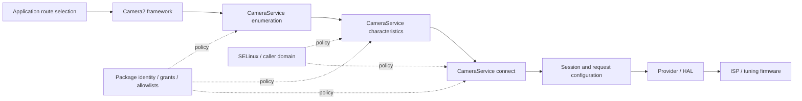
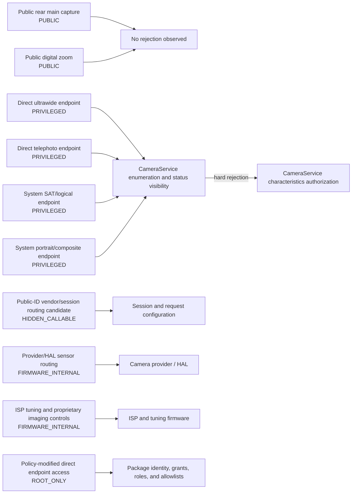

# Galaga camera privilege-boundary diagram

Status: executable per-feature enforcement map for CAM-086.

Target: **CMF Phone 2 Pro** (`Galaga`), Android 16, MediaTek MT6878.

## Evidence classification

- **VERIFIED:** Observed route tables, public visibility, system-only characteristics rejections, and recorded API error namespaces are preserved as verified evidence.
- **PARTIALLY VERIFIED:** AOSP method anchors and deployment consequences identify the expected boundary without proving the target implementation is byte-identical or sufficient for access.
- **UNKNOWN:** Connect-stage privilege parity, route-specific vendor session state, provider/HAL selection, SELinux grants, and ISP tuning contracts remain unknown until measured.

## Enforcement stack



## Feature-to-boundary diagram



## Access classes

| Class | Definition |
|---|---|
| `PUBLIC` | Callable by an ordinary application through supported Android APIs on the tested build. |
| `HIDDEN_CALLABLE` | A hidden or vendor interface may be callable without system-camera identity, but the exact route has not been reproduced. |
| `PRIVILEGED` | Requires caller eligibility beyond an ordinary application, such as SYSTEM_CAMERA plus associated package policy. |
| `ROOT_ONLY` | Requires policy, filesystem, service, or firmware changes outside the ordinary application sandbox. |
| `FIRMWARE_INTERNAL` | Implemented inside provider, HAL, ISP, tuning, or native firmware components with no verified application contract. |

## Per-feature enforcement map

| Feature | Route | Access class | First observed difference | First hard rejection | Confidence | Replacement consequence | Evidence |
|---|---|---|---|---|---|---|---|
| Public rear main capture | Wide / Camera2 ID 0 | `PUBLIC` | `None observed` / `NO_REJECTION_OBSERVED` | — | `VERIFIED` | Implement in the ordinary Camera2 backend and expose as a real optical wide route. | [`public-camera-baseline`](./SYSTEM_CAMERA_FILTERING_MODEL.md) |
| Public digital zoom | Wide / ID 0 plus crop | `PUBLIC` | `None observed` / `NO_REJECTION_OBSERVED` | — | `VERIFIED` | Label the result as digital zoom and never substitute it while reporting an optical ultrawide or telephoto route. | [`public-camera-baseline`](./SYSTEM_CAMERA_FILTERING_MODEL.md), [`galaga-expert-route`](./GALAGA_EXPERT_DIRECT_ROUTE.md) |
| Direct ultrawide endpoint | UltraWide / Camera2 ID 2 | `PRIVILEGED` | `CAMERA_SERVICE_ENUMERATION` / `FILTERED` | `CAMERA_SERVICE_CHARACTERISTICS` / `REJECTED` | `VERIFIED` | Keep the Galaga auxiliary backend fail-closed in ordinary builds; enable only after an independent lawful authorization probe succeeds. | [`galaga-expert-route`](./GALAGA_EXPERT_DIRECT_ROUTE.md), [`system-camera-filtering`](./SYSTEM_CAMERA_FILTERING_MODEL.md), [`camera-error-taxonomy`](./CAMERA_ERROR_TAXONOMY.md), [`authorization-comparison`](./CAMERA_AUTHORIZATION_COMPARISON.md) |
| Direct telephoto endpoint | Telephoto / Camera2 ID 3 | `PRIVILEGED` | `CAMERA_SERVICE_ENUMERATION` / `FILTERED` | `CAMERA_SERVICE_CHARACTERISTICS` / `REJECTED` | `VERIFIED` | Keep the Galaga auxiliary backend fail-closed in ordinary builds; enable only after an independent lawful authorization probe succeeds. | [`galaga-expert-route`](./GALAGA_EXPERT_DIRECT_ROUTE.md), [`system-camera-filtering`](./SYSTEM_CAMERA_FILTERING_MODEL.md), [`camera-error-taxonomy`](./CAMERA_ERROR_TAXONOMY.md), [`authorization-comparison`](./CAMERA_AUTHORIZATION_COMPARISON.md) |
| System SAT/logical endpoint | Candidate logical Camera2 ID 4 | `PRIVILEGED` | `CAMERA_SERVICE_ENUMERATION` / `FILTERED` | `CAMERA_SERVICE_CHARACTERISTICS` / `REJECTED` | `VERIFIED` | Do not route ordinary captures through ID 4 or present it as available until its role and authorization are independently reproduced. | [`system-camera-filtering`](./SYSTEM_CAMERA_FILTERING_MODEL.md), [`camera-error-taxonomy`](./CAMERA_ERROR_TAXONOMY.md), [`system-camera-contract`](./SYSTEM_CAMERA_BOUNDARY.md) |
| System portrait/composite endpoint | Candidate logical Camera2 ID 5 | `PRIVILEGED` | `CAMERA_SERVICE_ENUMERATION` / `FILTERED` | `CAMERA_SERVICE_CHARACTERISTICS` / `REJECTED` | `VERIFIED` | Treat portrait/composite access as unavailable in the ordinary backend until both role and authorization are reproduced. | [`system-camera-filtering`](./SYSTEM_CAMERA_FILTERING_MODEL.md), [`camera-error-taxonomy`](./CAMERA_ERROR_TAXONOMY.md), [`system-camera-contract`](./SYSTEM_CAMERA_BOUNDARY.md) |
| Public-ID vendor/session routing candidate | ID 0 plus MediaTek/Nothing session or request state | `HIDDEN_CALLABLE` | `SESSION_CONFIGURATION` / `UNRESOLVED` | — | `UNKNOWN` | Research only exact typed keys and values; add an ordinary backend solely after controlled positive and negative reproduction. | [`galaga-expert-route`](./GALAGA_EXPERT_DIRECT_ROUTE.md), [`camera-error-taxonomy`](./CAMERA_ERROR_TAXONOMY.md) |
| Provider/HAL sensor routing | Vendor provider or HAL internal selection | `FIRMWARE_INTERNAL` | `PROVIDER_HAL` / `UNRESOLVED` | — | `UNKNOWN` | Keep provider/HAL assumptions out of the ordinary backend and expose only measured capabilities through device-specific adapters. | [`galaga-expert-route`](./GALAGA_EXPERT_DIRECT_ROUTE.md), [`system-camera-contract`](./SYSTEM_CAMERA_BOUNDARY.md) |
| ISP tuning and proprietary imaging controls | ISP, tuning blobs, native libraries, or firmware services | `FIRMWARE_INTERNAL` | `ISP` / `UNRESOLVED` | — | `UNKNOWN` | Build independent on-device imaging stages and treat proprietary tuning access as unavailable until a lawful, reproducible interface is documented. | [`camera-error-taxonomy`](./CAMERA_ERROR_TAXONOMY.md), [`system-camera-contract`](./SYSTEM_CAMERA_BOUNDARY.md) |
| Policy-modified direct endpoint access | IDs 2 through 5 after package/service/SELinux policy changes | `ROOT_ONLY` | `PACKAGE_POLICY` / `REQUIRES_POLICY_CHANGE` | — | `PARTIALLY_VERIFIED` | Implement only as a separately packaged rooted/custom-ROM backend; keep SELinux and CameraService policy as independent gates to verify rather than assumed bypasses. | [`authorization-comparison`](./CAMERA_AUTHORIZATION_COMPARISON.md), [`system-camera-filtering`](./SYSTEM_CAMERA_FILTERING_MODEL.md), [`system-camera-contract`](./SYSTEM_CAMERA_BOUNDARY.md) |

## Deployment separation

| Deployment | Allowed | Conditional | Must not be claimed | Consequence |
|---|---|---|---|---|
| Ordinary public application | `PUBLIC` | `HIDDEN_CALLABLE` | `PRIVILEGED`, `ROOT_ONLY`, `FIRMWARE_INTERNAL` | Ship only public routes and independently reproduced vendor routes; keep system-camera backends fail-closed. |
| Legitimate OEM/system deployment | `PUBLIC`, `PRIVILEGED` | `HIDDEN_CALLABLE`, `FIRMWARE_INTERNAL` | `ROOT_ONLY` | Requires an authorized package identity, grants, allowlists, roles, AppOps, and matching SELinux/service policy. |
| Rooted or custom-ROM integration | `PUBLIC`, `HIDDEN_CALLABLE`, `PRIVILEGED`, `ROOT_ONLY` | `FIRMWARE_INTERNAL` | — | Implement as a separate backend with explicit installation, policy, compatibility, and recovery requirements. |
| Stock-camera handoff | `PUBLIC`, `PRIVILEGED` | — | `HIDDEN_CALLABLE`, `ROOT_ONLY`, `FIRMWARE_INTERNAL` | Can invoke the official app but does not provide in-process frame access or constitute a complete replacement. |

## Current decisive boundaries

- IDs `2`, `3`, `4`, and `5` first differ at ordinary CameraService enumeration and are then hard-rejected at characteristics as system-only devices.
- The existing ordinary hidden-ID probe does not independently reach CameraService connect; it stops during characteristics preflight.
- The stock Galaga manual table directly selects IDs `2`, `0`, and `3`, but the stock package authorization mechanism remains unresolved.
- Package identity, grants, roles, and allowlists are distinct from SELinux; no target SELinux denial has yet been established as the first rejection.
- No ordinary-callable vendor/session route, provider/HAL sensor-selection contract, or ISP tuning contract has been causally reproduced.

## Unresolved work

- `public-id-vendor-routing`: Vendor session, request, and physical-output mechanisms exist, but no exact ordinary-callable route has been reproduced.
- `provider-hal-sensor-routing`: Static application evidence does not identify a verified application contract for provider/HAL sensor selection.
- `isp-tuning-controls`: No stable application-level contract or causal route-specific tuning interface has been verified.

## Generation

This document is generated from `research/boundaries/galaga-camera-privilege-boundaries.json`:

```bash
python3 tools/research/build-camera-privilege-boundary.py \
  --markdown docs/research/CAMERA_PRIVILEGE_BOUNDARY.md \
  --json /private/galaga-camera-privilege-boundary.json
```
